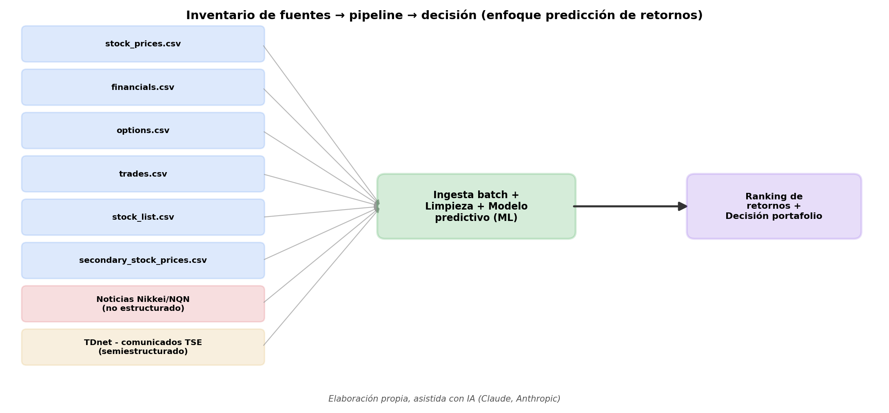
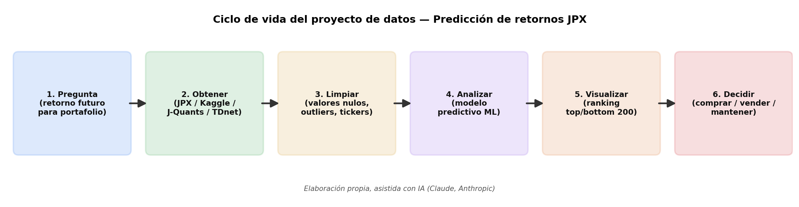

# Diagnóstico de Datos de un Proceso — Predicción de Retornos en el Mercado Bursátil de Tokio (JPX)

**Actividad Calificable · Corte 1 | Ciencia de Datos | Entrega Individual**


---

## 📌 Descripción

Diagnóstico de datos aplicado a un proceso real de decisión financiera: **la construcción de portafolios de inversión en el mercado bursátil japonés**. El proyecto utiliza el dataset **JPX Tokyo Stock Exchange Prediction**, publicado en Kaggle por Japan Exchange Group (JPX), y responde a la pregunta de si es posible predecir el retorno futuro de cada acción para generar un ranking que maximice la diferencia de retorno entre las 200 acciones con mejor y peor desempeño esperado. El trabajo cubre el inventario de datos, la clasificación del tipo de analítica, la justificación como caso de Big Data (5 V's), el ciclo de vida del proyecto y la comparación con el enfoque independiente de un compañero de curso sobre el mismo dataset.

> 📄 El desarrollo extendido de este trabajo (portada, tabla de contenidos, abstract, marco teórico completo) está en **`TRABAJO_I_CORTE.pdf`**, incluido en esta misma carpeta.

---

## 📌 Nota importante: mismo dataset, enfoques distintos

Las actividades formativas de las semanas 1 a 4 (opcionales, sin nota) se desarrollaron **en pareja** con Iván David Cardozo Charry, por lo que ambos exploramos desde el inicio del corte el mismo dataset. La actividad calificable de este Corte 1 es de **entrega individual**: se mantiene el mismo dataset ya explorado (evitando partir de cero), pero cada integrante desarrolló su propia pregunta de negocio y enfoque analítico independiente.

| | Mi enfoque | Enfoque del compañero |
|---|---|---|
| **Pregunta de negocio** | Predicción del retorno futuro de cada acción para construir un portafolio de inversión | Análisis de patrones de volumen de negociación institucional como señal anticipada de movimientos de precio |
| **Archivo(s) protagonista(s)** | `stock_prices.csv`, `financials.csv` | `trades.csv` |
| **Tipo de ML** | Supervisado — regresión/ranking | Supervisado — clasificación/regresión sobre variación de precio |
| **Granularidad temporal** | Diaria | Semanal |

---

## 🏗️ Arquitectura del análisis

| Etapa | Función | Fuentes / herramientas involucradas |
|---|---|---|
| **1. Pregunta** | Formular la pregunta de negocio y de datos | Definición del problema |
| **2. Obtener** | Descargar y consolidar las fuentes de datos | Kaggle, J-Quants API/Pro, TDnet, noticias Nikkei/NQN |
| **3. Limpiar** | Tratar nulos, outliers y alinear granularidad temporal | Python (Pandas), reglas de validación temporal |
| **4. Analizar** | Entrenar el modelo predictivo supervisado | ML (Gradient Boosting / LightGBM) sobre variable *target* |
| **5. Visualizar** | Generar el ranking y los dashboards de apoyo | Python/Matplotlib, Power BI |
| **6. Decidir** | Construir el portafolio (compra/venta) | Decisión de negocio del inversionista institucional |

---

## 🎯 Objetivo general

Diagnosticar la viabilidad y estructura de los datos disponibles en el conjunto **JPX Tokyo Stock Exchange Prediction**, con el fin de determinar su pertinencia para modelar y predecir el retorno futuro de acciones del mercado bursátil japonés, como insumo para la construcción de un portafolio de inversión basado en un ranking de retornos esperados.

## 🎯 Objetivos específicos

- **Formular** una pregunta de negocio clara y accionable sobre la predicción de retornos bursátiles.
- **Elaborar** un inventario de al menos seis fuentes/campos de datos, clasificando cada una por su nivel de estructura.
- **Determinar** el tipo de analítica de datos aplicable y evaluar si el caso constituye un escenario de Big Data mediante las cinco V's.
- **Diseñar** el ciclo de vida del proyecto de datos aplicado al caso JPX, representado en diagramas de flujo.
- **Diferenciar** el enfoque analítico individual de este documento del enfoque del compañero/a de trabajo en pareja.

---

## ❓ Problema y pregunta de datos

**Problema real:** los inversionistas institucionales en el mercado japonés deben decidir, entre ~2000 acciones listadas en la Bolsa de Tokio (TSE), cuáles comprar, mantener o vender para maximizar el retorno de su portafolio y minimizar el riesgo asumido.

**Pregunta de datos:**
> ¿Es posible predecir el retorno futuro de cada acción del mercado bursátil japonés, utilizando datos históricos de precios, resultados financieros y variables de mercado, con el fin de generar un ranking que maximice la diferencia de retorno entre las 200 acciones con mejor desempeño esperado y las 200 con peor desempeño esperado?

Esta pregunta reproduce el reto de evaluación definido por la competencia original organizada por Japan Exchange Group (JPX) en colaboración con AlpacaJapan Co., Ltd. [1].

---

## 🌐 Problem & Data *(English section)*

Institutional investors operating in the Japanese equity market face the recurring operational challenge of deciding which of roughly 2,000 stocks listed on the Tokyo Stock Exchange (TSE) to buy, hold, or sell during each trading period, in order to build a portfolio that maximizes expected return while managing risk [1]. Making this decision systematically requires historical daily stock prices, quarterly corporate financial results, options market activity, and aggregated weekly trading volumes, all of which are provided through the JPX Tokyo Stock Exchange Prediction dataset hosted on Kaggle and originally sourced from Japan Exchange Group's official data infrastructure [1], [2], [3]. Beyond the six structured files included in the original dataset, this project also incorporates semi-structured corporate disclosure records published through TDnet and unstructured financial news covering the listed companies, so the data inventory reflects the full range of structures found in a real business problem [4], [5]. The analytics type required is primarily **predictive analytics**, solved through **supervised machine learning** trained on the labeled *target* column of `stock_prices.csv` [2], with a secondary **prescriptive** component: the final output is an actionable ranking decision informing portfolio composition [1]. Given the combination of structured, semi-structured, and unstructured sources, this problem also raises meaningful **data veracity** and **variety** challenges characteristic of Big Data scenarios [2].

---

## 🗂️ Inventario de datos (8 fuentes)

| # | Fuente / Campo | Tipo de dato | Descripción breve | Ref. |
|---|---|---|---|---|
| 1 | `stock_prices.csv` | Estructurado | Precio de cierre diario (OHLC) y columna *target* (retorno) | [2] |
| 2 | `financials.csv` | Estructurado | Resultados de reportes de ganancias trimestrales | [2] |
| 3 | `options.csv` | Estructurado | Estado de opciones sobre el mercado japonés | [2] |
| 4 | `trades.csv` | Estructurado | Volúmenes de trading agregados de la semana anterior | [2] |
| 5 | `stock_list.csv` | Estructurado | Código de acción ↔ nombre de empresa ↔ industria | [2] |
| 6 | `secondary_stock_prices.csv` | Estructurado | Precios de valores menos líquidos | [2] |
| 7 | Noticias financieras Nikkei/NQN | **No estructurado** | Texto narrativo libre sobre eventos corporativos | [5] |
| 8 | Comunicados TDnet (TSE) | **Semiestructurado** | PDF/XBRL + metadatos (fecha, código, tipo) | [4] |

📎 Tabla completa con justificación de clasificación disponible en `Inventario_datos_JPX.xlsx` (hoja **"Inventario de datos"**) y en el PDF.


*Figura 1. Flujo de las ocho fuentes de datos hacia el pipeline de análisis y la decisión final de portafolio. Elaboración propia, asistida con IA (Claude, Anthropic).*

---

## 🧠 Tipo de analítica aplicada

| Tipo | Pregunta que responde | ¿Aplica al proyecto? |
|---|---|---|
| Descriptiva | ¿Qué pasó? | Sí (etapa de apoyo) |
| Diagnóstica | ¿Por qué pasó? | Parcial |
| **Predictiva** | ¿Qué pasará? | **Sí — núcleo del proyecto** |
| Prescriptiva | ¿Qué se debería hacer? | Sí (salida final) |

**Tipo de ML:** supervisado (regresión/ranking), dado que el dataset ya contiene la variable objetivo (*target*) para entrenar y validar el modelo [2].

📎 Detalle completo en `Inventario_datos_JPX.xlsx` (hoja **"Tipo de analitica"**) y en el PDF.

---

## 📈 ¿Es un caso de Big Data? Justificación con las 5 V's

| V | Nivel | Justificación breve |
|---|---|---|
| Volumen | Media-Alta | ~2000 acciones × varios años de precios, financieros y opciones |
| Velocidad | Media | Actualización diaria/semanal; procesamiento *batch* suficiente |
| **Variedad** | **Alta** | Estructurado + semiestructurado (TDnet) + no estructurado (noticias) |
| **Veracidad** | **Alta (reto principal)** | Nulos, ruido en noticias, desalineación temporal entre fuentes |
| Valor | Alta | Impacto económico directo en decisiones de inversión reales |

**Conclusión:** el caso se justifica como Big Data principalmente por **variedad** y **veracidad**, más que por el volumen bruto de los archivos [9].

📎 Análisis completo, reto de veracidad y mitigación en `Inventario_datos_JPX.xlsx` (hoja **"Big Data - 5 V"**) y en el PDF.

---

## 🔄 Ciclo de vida del proyecto


*Figura 2. Ciclo de vida del proyecto de datos aplicado al caso de predicción de retornos JPX. Elaboración propia, asistida con IA (Claude, Anthropic).*


📎 Tabla de las 6 etapas con aplicación al caso y herramientas en `Inventario_datos_JPX.xlsx` (hoja **"Ciclo de vida"**) y en el PDF.

---

## 🆚 Comparación de enfoques con el trabajo del compañero

| Criterio | Mi enfoque | Enfoque del compañero |
|---|---|---|
| Pregunta de negocio | Predicción de retorno para portafolio (top/bottom 200) | Volumen de trading como señal de movimientos de precio |
| Archivo protagonista | `stock_prices.csv`, `financials.csv` | `trades.csv` |
| Tipo de analítica dominante | Predictiva con salida prescriptiva | Predictiva con foco diagnóstico |
| Tipo de ML | Supervisado — regresión/ranking | Supervisado — clasificación/regresión |
| Granularidad temporal | Diaria | Semanal |
| V crítica del Big Data | Variedad y Veracidad | Veracidad (agregación temporal) |

**Conclusión:** ambos trabajos parten del mismo dataset por continuidad del trabajo en pareja, pero constituyen **análisis individuales, independientes y complementarios**, cumpliendo el carácter individual de la actividad calificable.

📎 Tabla completa en `Inventario_datos_JPX.xlsx` (hoja **"Comparacion enfoques"**) y en el PDF.

---

## ✅ Conclusiones

El dataset **JPX Tokyo Stock Exchange Prediction** demostró ser una fuente de datos robusta, verificable y bien documentada institucionalmente por Japan Exchange Group (JPX) [1], [2], apta tanto para las actividades formativas en pareja como para el desarrollo de análisis individuales diferenciados. El problema se clasificó como **analítica predictiva** con componente **prescriptivo**, resuelto mediante **aprendizaje automático supervisado** [2], [10], y se justificó como caso de **Big Data** principalmente por variedad y veracidad, más que por volumen bruto [9]. El ciclo de vida completo se trazó de forma coherente, identificando la desalineación temporal entre fuentes como el principal reto de limpieza. Finalmente, se demostró que este trabajo y el del compañero/a, aunque comparten el dataset de origen, constituyen entregas individuales, independientes y complementarias.

*(Conclusiones completas en el PDF adjunto).*

---

## 📁 Archivos de este repositorio

```
04-week/02-opcional-activity/trabajo
├── README.md                    ← este archivo (resumen técnico)
├── TRABAJO_I_CORTE.pdf          ← documento completo (portada, abstract, todas las secciones)
├── Inventario_datos_JPX.xlsx    ← anexo con tablas de inventario, analítica, Big Data y comparación
└── images/
    ├── ciclo_vida_mio.png
    └── inventario_mio.png
```

---

## 📚 Referencias (formato IEEE)

[1] Kaggle, "JPX Tokyo Stock Exchange Prediction," *Kaggle Competitions*, 2022. [Online]. Available: https://www.kaggle.com/competitions/jpx-tokyo-stock-exchange-prediction/overview. [Accessed: Aug. 30, 2026].

[2] Kaggle, "JPX Tokyo Stock Exchange Prediction — Data," *Kaggle Competitions*, 2022. [Online]. Available: https://www.kaggle.com/competitions/jpx-tokyo-stock-exchange-prediction/data. [Accessed: Aug. 30, 2026].

[3] Japan Exchange Group, "J-Quants API," *JPX Official Website*, 2026. [Online]. Available: https://www.jpx.co.jp/english/markets/other-data-services/j-quants-api/. [Accessed: Aug. 30, 2026].

[4] Japan Exchange Group, "Overview of TDnet," *JPX Official Website*, 2022. [Online]. Available: https://www.jpx.co.jp/english/equities/listing/disclosure/tdnet/index.html. [Accessed: Aug. 30, 2026].

[5] QUICK Corp., "QUICK APIs — Data Coverage (Nikkei/NQN News)," *QUICK Corporate Website*, 2022. [Online]. Available: https://corporate.quick.co.jp/en/apis/. [Accessed: Aug. 30, 2026].

[6] Japan Exchange Group, "Availability of English Disclosure Information by Listed Companies," *JPX English Disclosure GATE*, 2026. [Online]. Available: https://www.jpx.co.jp/english/equities/listed-co/disclosure-gate/availability/. [Accessed: Aug. 30, 2026].

[7] Japan Exchange Group, "J-Quants Pro," *JPX Official Website*, 2025. [Online]. Available: https://www.jpx.co.jp/english/markets/other-data-services/j-quants-pro/index.html. [Accessed: Aug. 30, 2026].

[8] Japan Exchange Group, "JPxData Portal," *JPX Official Website*, 2026. [Online]. Available: https://www.jpx.co.jp/english/markets/data-catalog/index.html. [Accessed: Aug. 30, 2026].

[9] IBM, "What is Big Data?," *IBM Think*, 2026. [Online]. Available: https://www.ibm.com/think/topics/big-data. [Accessed: Aug. 30, 2026].

[10] Qlik, "Embrace the Future — Make the Move from Descriptive to Prescriptive Analytics," *Qlik Blog*, 2022. [Online]. Available: https://www.qlik.com/blog/embrace-the-future-moving-from-descriptive-to-prescriptive-analytics. [Accessed: Aug. 30, 2026].

---

## 👤 Autora

| Nombre | Rol |
|---|---|
| **Zara Melisa Monroy Vera** | Autora (entrega individual) |

**Trabajo formativo en pareja (semanas 1-4, base del dataset):** Iván David Cardozo Charry

---

## 🎓 Información Académica

**Programa:** Ingeniería Industrial
**Asignatura:** Electiva VI Ciencia de Datos (Cód. 69109) [Pénsum 40D, Grupo 1]
**Institución:** Corporación Universitaria del Huila — CORHUILA
**Docente:** Jesús Ariel González Bonilla
**Fecha:** Agosto 30 de 2026

---


```
FULL_NAME: Zara Melisa Monroy Vera
GITHUB_USER: zara-mon2006
```

> Proyecto académico desarrollado para la Electiva VI Ciencia de Datos — Ingeniería Industrial, Corte 1, 2026-B.
